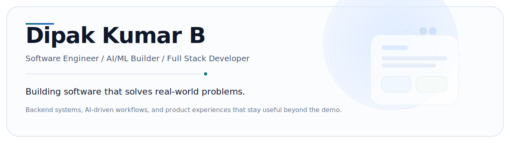
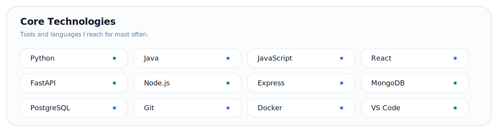
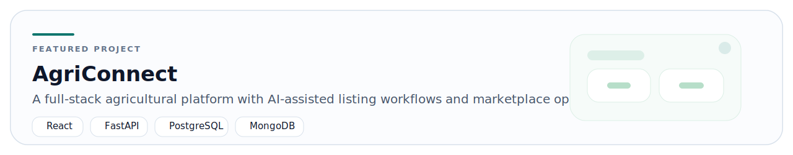
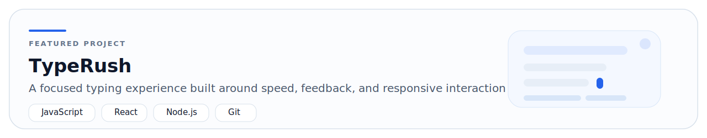
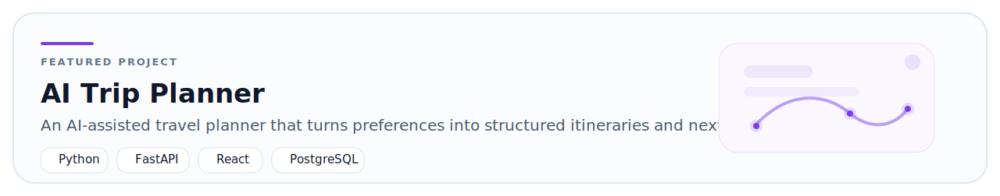

  

## Introduction

I'm an Electrical & Electronics Engineering student at SSN College of Engineering building backend-first software with AI and clean user experiences. Recent work includes an AI/ML internship, hackathon-winning builds, and full-stack projects shaped around practical problems.

## What I'm Currently Doing

- Building with Python, FastAPI, Node.js, React, and PostgreSQL.
- Spending more time on backend engineering, AI, full-stack product work, and distributed systems fundamentals.
- Looking for problems that reward careful implementation, product thinking, and good engineering taste.

## Tech Stack

  

## Featured Projects

  

  

  

  

  

  

## GitHub Statistics

  
  

## Contact

  <a href="mailto:dipakkumar2310830@ssn.edu.in">
    
    Email
  </a>
  &nbsp;&nbsp;&nbsp;
  <a href="https://github.com/Dipakkumar26">
    
    GitHub
  </a>

<!-- Add verified LinkedIn and portfolio URLs here when available. -->
