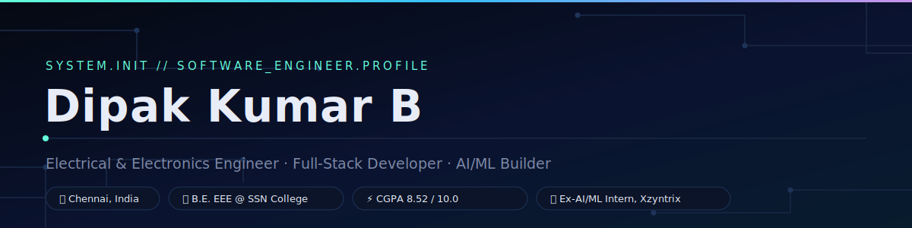
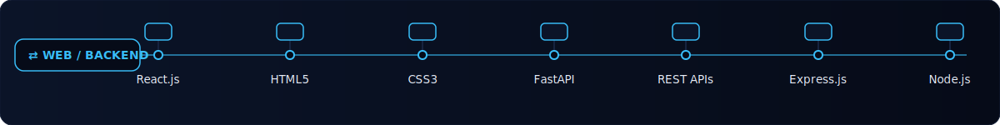
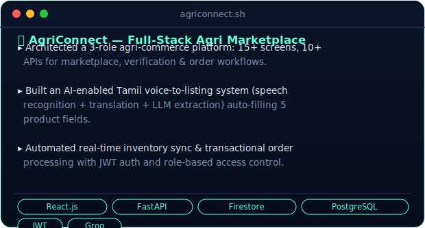

<div align="center">
  
</div>

<div align="center">
  <a href="mailto:dipakkumar2310830@ssn.edu.in"></a>
  <a href="https://linkedin.com/in/YOUR-LINKEDIN-ID"></a>
  <a href="https://github.com/YOUR-GITHUB-USERNAME"></a>
</div>


### `whoami`

```
> Undergrad in Electrical & Electronics Engineering, building on the software side.
> Shipped 3 production-style apps spanning full-stack + applied GenAI.
> Comfortable owning a feature end-to-end — schema to API to UI.
> Hackathon-tested: Lithos Hackathon & Circuit Crafts Competition winner.
```


## `stack --list`

<div align="center">
  
  <br/><br/>
  
  <br/><br/>
  
  <br/><br/>
  
</div>


## `ls ./projects`

<div align="center">
  
  <br/><br/>
  
  <br/><br/>
  
</div>


## `cat education.log`

| | |
|---|---|
| 🎓 **B.E. Electrical & Electronics Engineering** | Sri Sivasubramaniya Nadar College of Engineering · CGPA 8.52/10.0 · 2023–Present |
| 🏫 **12th Grade** | SBOA School and Junior College · 486/500 · 2021–2023 |

## `cat certifications.log`

- The Complete Web Development Bootcamp — *Udemy*
- Python for Everybody Specialization — *Coursera*
- REST API Development with FastAPI

## `cat achievements.log`

- 🥇 Winner — Lithos Hackathon
- 🥇 Winner — Circuit Crafts Competition


## `github --stats`

<div align="center">
  
  
  <br/>
  
</div>

<div align="center">
  
</div>
